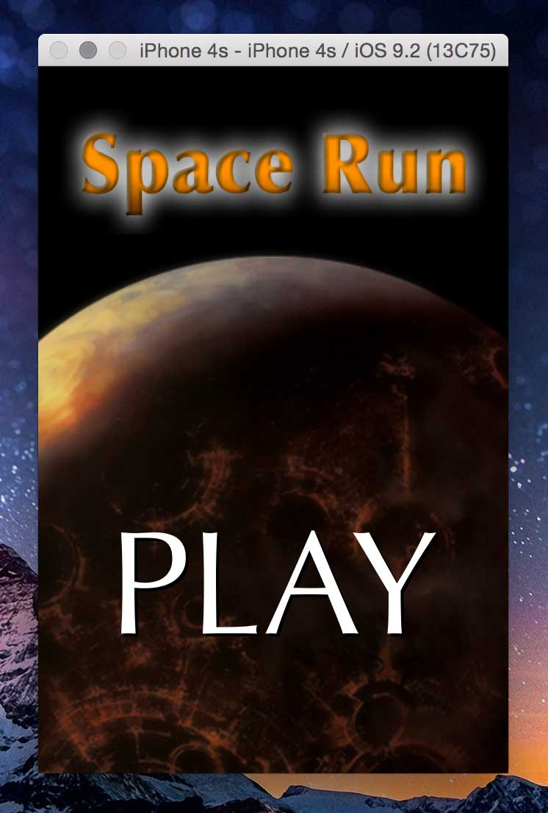
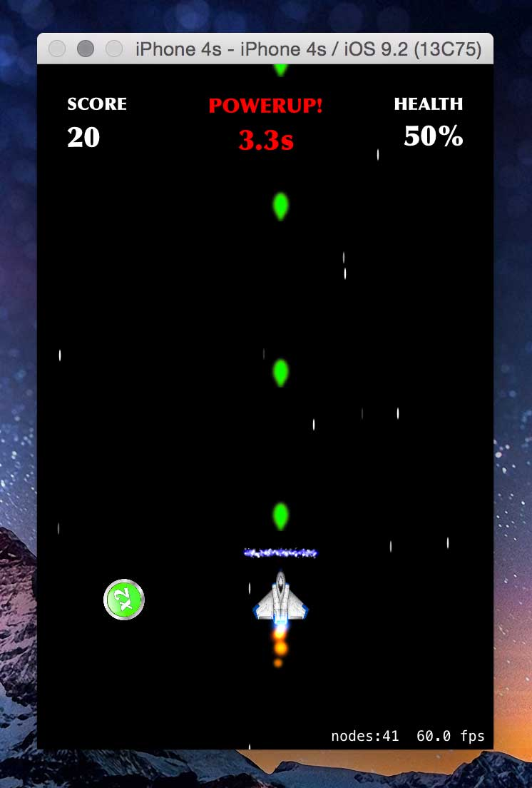
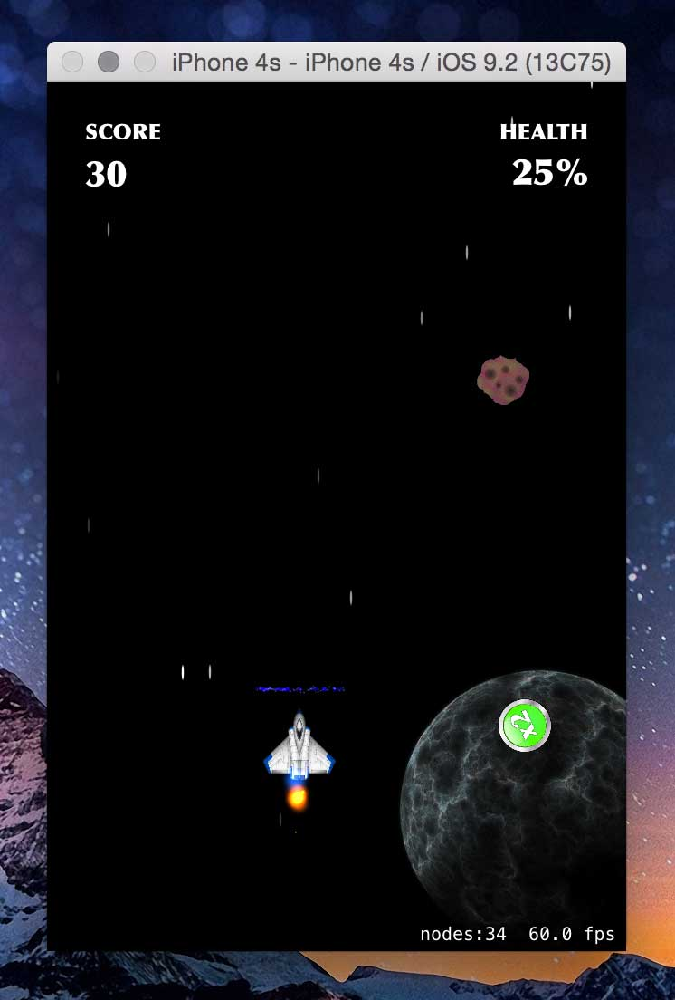
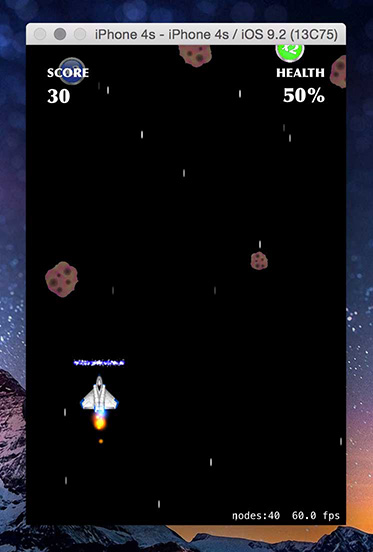
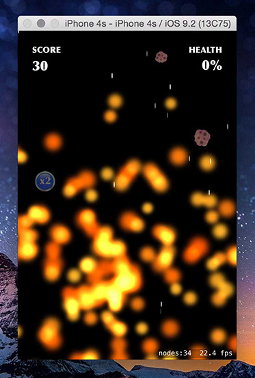
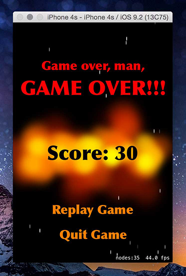

# Space Run

## An iOS iPhone Game using Objective-C

### About

This is my final project submitted for an Objective-C class. This game is based on the code game example given in the book "Build iOS Games with Sprite Kit - Unleash Your Imagination in Two Dimensions." I started with the base code and then modified it quite a bit. I also implemented shields, a health label, powerup status labels, ship speed and photon speed powerups, added a start and end screen, and refactored/added to existing objects and properties.

### Screenshots

